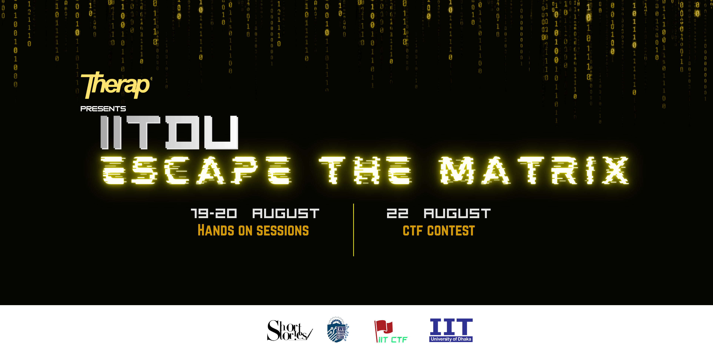

  

<h1 align="center">🔐 Therap presents IITDU Escape The Matrix 2026</h1>

  Official archive of the hands-on session materials and CTF challenges from <b>Therap presents IITDU Escape The Matrix 2026</b>.

---

## 🚩 About the Event

**Therap presents IITDU Escape The Matrix 2026** was a cybersecurity learning and Capture The Flag event organized by the **IITDU CTF Community**, Institute of Information Technology, University of Dhaka.

The event was designed to introduce early-year students of the University of Dhaka to practical cybersecurity through hands-on training followed by a competitive CTF.

The event featured:

* 🌐 Web Exploitation
* 🔍 Digital Forensics
* ⚙️ Reverse Engineering & Pwn
* 🏴 Online Mock CTF
* 🚩 3-Hour Onsite Solo CTF
* 🏆 Closing & Award Ceremony

More than **75 participants** from IIT, CSE, RME, and ISRT of the University of Dhaka took part in the hands-on sessions.

---

## 📅 Event Timeline

| Event                    | Date              | Details                            |
| ------------------------ | ----------------- | ---------------------------------- |
| Hands-On Sessions        | 19–20 August 2026 | Practical cybersecurity training   |
| Mock CTF                 | 21 August 2026    | Online • Solo • 3 Hours            |
| Main CTF                 | 22 August 2026    | Onsite • Solo • 2:00 PM – 5:00 PM  |
| Closing & Award Ceremony | 22 August 2026    | Awards, certificates & recognition |

📍 **Venue:** Institute of Information Technology (IIT), University of Dhaka

---

## 📚 Hands-On Sessions

### 🌐 Web Exploitation

**Instructor:** Anik Sutrodhar

The session covered fundamental web security concepts, common vulnerabilities, exploitation techniques, and practical approaches to web application security.

---

### 🔍 Digital Forensics

**Instructor:** Zaber Mahmud

The session introduced participants to digital evidence, forensic investigation techniques, digital artifact analysis, and practical approaches to digital forensics.

---

### ⚙️ Reverse Engineering & Pwn

**Instructor:** Md. Arib Zobair

The session focused on binary analysis, reverse engineering concepts, and fundamental binary exploitation techniques.

All three instructors represented the **EWU Cyber Security Club**, our Knowledge & CTF Partner.

---

## 🏴 CTF Contest

The final Capture The Flag competition was held on **22 August 2026**.

* **Format:** Jeopardy-Style CTF
* **Mode:** Solo
* **Venue:** Onsite at IIT, University of Dhaka
* **Duration:** 3 Hours
* **Contest Time:** 2:00 PM – 5:00 PM

Participants solved challenges from different cybersecurity domains and submitted flags to earn points.

The challenges included in this repository are preserved for learning, practice, and educational purposes.

---

## 🏆 Winners

| Award                              | Winner                 | Department / Batch |
| ---------------------------------- | ---------------------- | ------------------ |
| 🥇 Champion                        | **Tawrat Nibir**       | BSSE 16, IIT       |
| 🥈 1st Runner-Up                   | **Md Jannatul Adon**   | CSE 32             |
| 🥉 2nd Runner-Up                   | **Nabil Hasan**        | CSE 31             |
| 👩‍💻 Women in Cybersecurity Award | **Mst Mehenaz Khatun** | BSSE 17, IIT       |
| 🌟 Rising Cyber Talent Award       | **Abdullah Tasib**     | BSSE 18, IIT       |

> The Rising Cyber Talent Award was presented to the highest-ranked first-year participant.

---

## 🤝 Event Partners

### 🟡 Title Sponsor

**Therap**

### 🛡️ Knowledge & CTF Partner

**EWU Cyber Security Club**

### 📢 Media Partner

**Short Stories**

### 🚩 Organized By

**IITDU CTF Community**
Institute of Information Technology
University of Dhaka

---

## 👨‍🏫 Instructors & Challenge Contributors

Special appreciation goes to:

* **Anik Sutrodhar** — Web Exploitation
* **Zaber Mahmud** — Digital Forensics
* **Md. Arib Zobair** — Reverse Engineering & Pwn

Their contributions went beyond conducting the hands-on sessions. They also contributed to designing and preparing challenges for the CTF contest, helping create an engaging learning and competitive experience for the participants.

---

## ❤️ Acknowledgements

We sincerely thank **Therap** for supporting the initiative as the Title Sponsor of Escape The Matrix 2026.

We are grateful to the **EWU Cyber Security Club** for collaborating with us as our Knowledge & CTF Partner and contributing both instructors and CTF challenges.

We also thank **Short Stories**, our Media Partner, for helping us reach a wider audience.

Our sincere appreciation goes to **Dr. Nowshin Nower**, Director, Institute of Information Technology, University of Dhaka, for her support and presence at the Closing & Award Ceremony.

We are equally grateful to our Club Moderator, **Dr. B. M. Mainul Hossain**, for his continuous guidance and encouragement throughout the planning and execution of the event.

Finally, a huge thank you to every member of the **IITDU CTF Community**, our volunteers, and all participants who contributed to making the community's first event a success.

---

## ⚠️ Educational Use Only

The materials and CTF challenges available in this repository are intended strictly for **educational, research, and authorized security testing purposes**.

Please use the techniques demonstrated here only on:

* Systems you own
* CTF environments
* Practice laboratories
* Systems for which you have explicit authorization to test

Do not use these materials for unauthorized access, exploitation, or malicious activities.

---

## 🚩 IITDU CTF Community

The **IITDU CTF Community** is a cybersecurity-focused student community based at the Institute of Information Technology, University of Dhaka.

**Escape The Matrix 2026** marked the first major event of the community.

Our goal is to create opportunities for students to:

* Learn practical cybersecurity
* Participate in Capture The Flag competitions
* Explore different cybersecurity domains
* Share knowledge and resources
* Connect with the wider cybersecurity community
* Build a stronger cybersecurity culture at the University of Dhaka

---

## 🔮 What's Next?

Escape The Matrix 2026 may be over, but this was only the beginning.

**More learning. More challenges. More flags. 🚩**

  <b>Until we meet again inside the Matrix.</b>

---

  <b>IITDU CTF Community</b> 
  Institute of Information Technology 
  University of Dhaka

  🔐 Learn • Exploit • Capture • Escape

